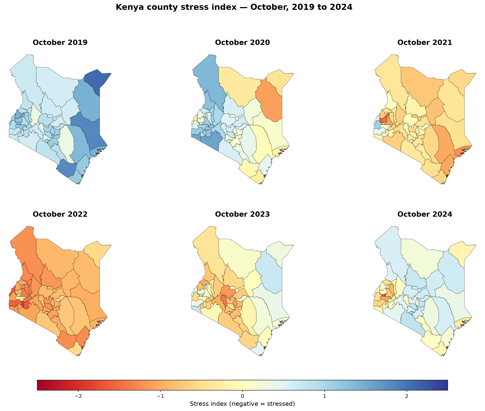

# Kenya Climate Data Lab

**A county-level drought and vegetation stress monitor for all 47 Kenyan counties.**

**Latest:** [I Tried to Validate My Tool. It Failed.](https://kenyaclimatelab.substack.com/p/i-tried-to-validate-my-tool-it-failed)

---

## What this is

Kenya Climate Data Lab is a 72-week open-source project building a **weekly county-level drought and vegetation stress monitor** for all 47 counties in Kenya.

The tool combines CHIRPS satellite rainfall and Sentinel-2 vegetation health (NDVI) into a composite stress index, refreshed monthly. It answers one question for every county: *how unusual is this month compared to the historical norm for this time of year?*

## The gap

Existing Kenya monitoring tools each miss something:

| Tool | Updates | Granularity |
|---|---|---|
| FAO Agricultural Stress Index | Every 10 days | Sub-county, not administrative |
| FEWS NET Kenya | Monthly | Livelihood zone |
| GEOGLAM Crop Monitor | Monthly | Crop zone |
| KNBS National Agriculture Production Report | Annual, post-harvest | County |

**The tools that update often don't give county yields. The tool that gives county data comes out once a year — too late to help.**

This project fills that gap: fast, county-level, weekly updates for all 47 counties.

## Validation — the 2022 Horn of Africa drought

The monitor's first real test was the 2021–2022 Horn of Africa drought — the worst in 40 years, with five consecutive failed rainy seasons.

The tool detected it **without any calibration** — purely by comparing each county-month to its own historical average.

The 2022 panel shows severe or moderate stress in every county. NDVI values fell to −1.35 z-scores in December 2022, while rainfall anomaly peaked lower at −0.89.

**Key design implication:** NDVI captures accumulated drought damage; rainfall captures single-season failures. The composite index weights NDVI at 65% and rainfall at 35%.

## How it works

The pipeline runs in two tiers:

**Tier 1 — weekly rainfall** (fast update)
CHIRPS daily files -> weekly aggregates -> per-county weekly anomaly

**Tier 2 — monthly composite** (richer signal)
Rainfall (aggregated to monthly) + NDVI -> per-county monthly anomaly -> composite stress index

Full pipeline documentation: [docs/architecture.md](docs/architecture.md).

## Data sources

| Dataset | Source | Coverage | Role |
|---|---|---|---|
| CHIRPS rainfall | data.chc.ucsb.edu | 2010-2024, 47 counties | Primary rainfall signal |
| Sentinel-2 NDVI | Google Earth Engine | 2017-2024, 47 counties | Primary vegetation signal |
| ERA5-Land climate | Earth Data Hub | 1990-2024, 9 variables | Temperature, soil moisture |
| iSDAsoil | iSDA Africa | 8 properties, 20M px/county | Soil covariates |
| FAOSTAT yield | fao.org/faostat | 1961-2024, national | Validation |
| KNBS county maize | knbs.or.ke | 2020-2024, county | Validation |
| Kenya boundaries | geoBoundaries | 47 counties, GeoJSON | Spatial reference |

See `data/metadata/sources.md` for full details.

## Repository structure

    kenya-climate-data-lab/
    ├── data/
    │   ├── raw/                   Original downloads (never edited)
    │   ├── processed/             Cleaned and merged tables
    │   ├── external/              Kenya county boundaries (GeoJSON)
    │   └── metadata/              sources.md, data_dictionary.md, crop_calendar
    ├── notebooks/                 Exploration and diagnostics
    ├── scripts/                   Reproducible data pipelines
    │   └── gee/                   Google Earth Engine scripts
    ├── paper/figures/             Figures for posts and papers
    ├── dashboard/                 (planned) Public dashboard
    ├── app/                       (planned) Interactive tool
    ├── docs/
    │   ├── advisory/              External feedback notes
    │   ├── architecture.md        Pipeline documentation
    │   ├── why-maize.md           Problem statement
    │   └── weekNN_reflection.md   Weekly reflections
    ├── metrics/                   Weekly log + screenshots
    └── README.md

## Current status

- **Phase:** Foundation (Week 5 of 72)
- **Master table:** `county_monthly_stress_v3.csv` — 4,512 rows x 27 cols
- **Weekly product:** `county_weekly_stress_2017_2024.csv` — 19,599 rows
- **Stress monitor:** Working, monthly composite + weekly rainfall
- **2022 drought validation:** Detected without calibration. 31 counties severe unweighted, 8 crop-severe weighted
- **Soil moisture lead-lag:** 1 month, r=0.461, 95% CI [0.436, 0.485]
- **Coverage:** All 47 Kenyan counties, 2017-2024
- **Independent cross-checks:** NDMA (zero overlap, CHIRPS-verified), CCRP (3 of 8 indices), TAMSAT (contemporaneous comparison)
- **Next milestone:** Preprint draft (Week 6)

## Week 4 highlights

- **Crop calendar integration:** Stress is weighted by maize growth stage (planting 1.0, grain_fill 0.7, harvest 0.3, fallow 0.0). A dry October in Trans Nzoia (harvest) now scores differently than a dry October in Kakamega (planting).
- **ERA5 integration:** Soil moisture, temperature, and evaporation anomalies joined as diagnostic columns.
- **Weekly product:** Rainfall updates weekly; monthly companions carry forward the last-confirmed stress reading.
- **Hardening pass:** Crop-weight sensitivity (28 combos), within-county lead-lag verification, bootstrap CI, and a per-county 2022 severity table. See `docs/week04_hardening.md`.

## The findings

**1. Drought ≠ crop damage.**

Of 31 counties with severe drought in 2022, only 8 had severe drought while maize was actively growing: Bomet, Busia, Homa Bay, Kericho, Kilifi, Laikipia, Nandi, Nyamira. Kenya's largest maize producers aren't on the list — they had already harvested.

**2. Soil moisture leads vegetation by 1 month.**

r = 0.461 (95% CI [0.436, 0.485], p = 6e-223). Entirely temporal — survives county demeaning without shrinkage. Across 4,205 county-month observations.

**3. The tool covers a drought regime NDMA does not classify.**

Kenya's National Drought Management Authority tracks pastoral drought in 23 ASAL counties. In October 2022, NDMA flagged 11 counties as Alarm — all in the arid north. The monitor flagged a completely different set of 10 counties — the highland maize belt and the coast. Zero overlap.

CHIRPS verification: monitor counties averaged October 2022 rainfall z-score of **−1.14**; NDMA counties averaged **−0.71**. Both groups were in drought. The two systems track different things. NDMA tracks cumulative multi-season impact on pastoral livelihoods. The monitor tracks current-month rainfall and vegetation anomaly for all 47 counties.

The tool is complementary to NDMA, not competing. Full cross-check against NDMA, CCRP, TAMSAT, and KMD is in `docs/week05_null_result.md`.

**4. The tool is a drought monitor, not a yield predictor.**

I tried to validate the stress index against KNBS county yield data. Every meaningful test came back null, wrong-signed, or untestable. Documented publicly: [I Tried to Validate My Tool. It Failed.](https://kenyaclimatelab.substack.com/p/i-tried-to-validate-my-tool-it-failed)

## Development

    conda create -n kenya-climate python=3.11 -y
    conda activate kenya-climate
    pip install -r requirements.txt

## Contributing

Contributions welcome from anyone working in Kenyan agriculture, climate research, or data science.

- **Data** — county-level maize records, ground-truth rainfall, yield trial data — open an issue or email
- **Methodology** — if you see a flaw in the pipeline, open an issue with details
- **Code** — pull requests welcome, please open an issue first to discuss
- **Feedback** — reply to any post on the [Substack](https://kenyaclimatelab.substack.com)

## License

- **Code:** MIT
- **Data:** CC-BY-4.0 (where permitted by source licenses)

## Contact

**Alex Haro Nyandega** — alexharonyandega@gmail.com — Nairobi, Kenya

[GitHub](https://github.com/alexharonyandega-dev) · [X](https://x.com/KenyaClimateLab) · [Substack](https://kenyaclimatelab.substack.com) · [LinkedIn](https://linkedin.com/in/alexharonyandega)
