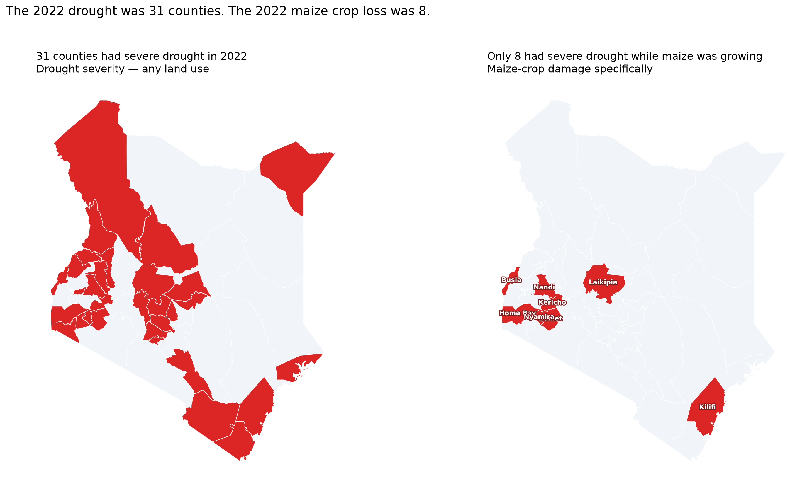
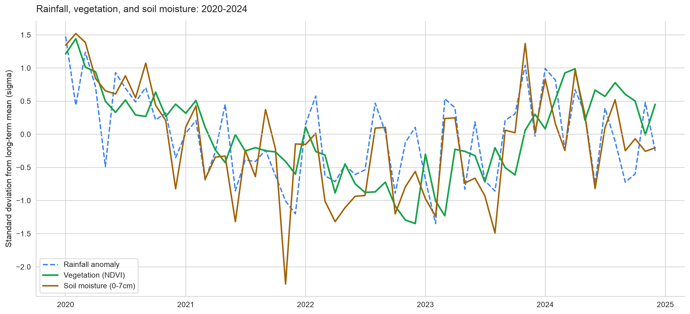
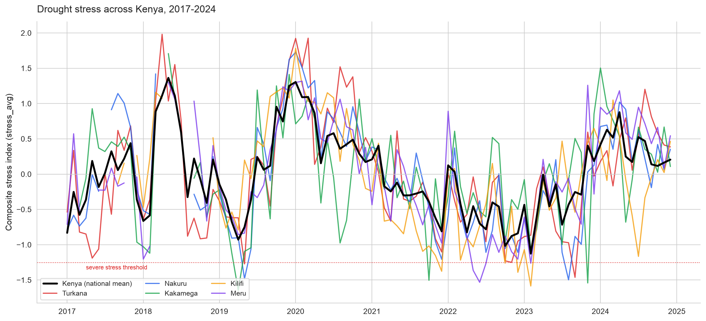
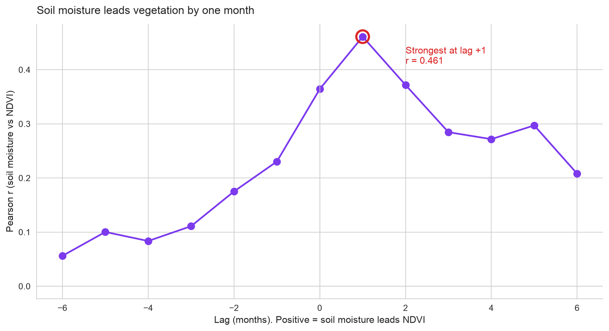

# Kenya Climate Data Lab — How to Use the Drought Monitor

**Version:** 0.3 (Week 8)
**Last updated:** 2026-10-10
**Repo:** github.com/alexharonyandega-dev/kenya-climate-data-lab

## What this tool does

It produces a monthly composite stress score for every Kenyan county,
based on rainfall and vegetation anomalies. The score tells you how
much worse — or better — the current month is compared to that
county's own historical norm for the same calendar month.

## What this tool does NOT do

- **It does not predict maize yield.** The stress index was tested
  against county-level yield data and the correlation was not strong
  enough to be useful. See `docs/week05_null_result.md`. That was the
  project's honest result and it stays documented.
- **It is not a forecast.** The score describes months that have
  already happened.
- **It is not a substitute for field assessment.** It is a screening
  tool, not an operational crop monitor.

## Quick start

1. Open `data/processed/county_monthly_stress_v3.csv` in Excel,
   Google Sheets, or pandas.
2. Filter rows where `county == "Nakuru"` (or any of the 47 counties).
3. Sort by `month_start` ascending.
4. Read the `stress_avg` column for the most recent months.
   Negative values = worse than normal. Positive = better.

## What the numbers mean

| Column | Meaning |
|---|---|
| `county` | One of the 47 Kenyan counties |
| `month_start` | First day of the month this row describes |
| `rainfall_mm` | Total rainfall that month |
| `rainfall_anomaly` | How unusual the rainfall was, in standard deviations. Negative = drier |
| `ndvi` | Greenness index from Sentinel-2 satellite (0 to 1). Higher = more vegetation |
| `ndvi_anomaly` | How unusual the greenness was, in standard deviations |
| `stress_avg` | Composite score: rainfall + NDVI, weighted 65/35 |
| `stress_min` | The worse of the two signals (rainfall or NDVI) |
| `stress_category` | One of: severe_stress / moderate_stress / normal / good / very_good |
| `stress_weighted` | stress_avg weighted by crop stage. A drought during planting hurts more than during fallow |
| `swvl1_mean_anomaly` | Soil moisture anomaly in the top 7 cm. Leads vegetation by about one month |

Full column reference: `data/metadata/data_dictionary.md`.

## Stress categories

| Category | Meaning |
|---|---|
| `severe_stress` | More than 1.25σ worse than normal |
| `moderate_stress` | 0.5σ to 1.25σ worse than normal |
| `normal` | Between -0.5σ and +0.5σ |
| `good` | 0.5σ to 1.25σ better than normal |
| `very_good` | More than 1.25σ better than normal |

## The four figures

*The 2022 Horn of Africa drought, before and after crop-stage weighting.*

*Rainfall, vegetation, and soil moisture diverge at drought onset.*

*A single county's stress score over the full 2017–2024 record.*

*Soil moisture anomalies precede vegetation anomalies by roughly one month (r = 0.461).*

## Early warning signal

The `swvl1_mean_anomaly` column — topsoil moisture, 0 to 7 cm — moves
about one month before `ndvi_anomaly`. If you want to anticipate next
month's vegetation stress, watch soil moisture this month.

## Limitations

- **Monthly resolution.** Not weekly, not daily.
- **County averages.** The score describes a county, not a farm.
- **Validated against one drought event** (2021–2022 Horn of Africa).
- **Non-climate shocks are not captured** — pests, conflict, market access.
- **Reference periods differ per source** (CHIRPS 2010–2024,
  Sentinel-2 2017–2024, ERA5-Land 1990–2024). See D43.

## Report a problem / contact

- GitHub issues: github.com/alexharonyandega-dev/kenya-climate-data-lab/issues
- Email: alex@kenyaclimatelab.me

## Data sources and license

- Rainfall: CHIRPS 0.05° daily, UCSB Climate Hazards Center
- Vegetation: Sentinel-2 NDVI via Google Earth Engine
- Soil moisture: ERA5-Land, Copernicus Climate Data Store
- Crop calendar: iSDAsoil + Kenya crop calendars

MIT licensed. Free to use and modify.
